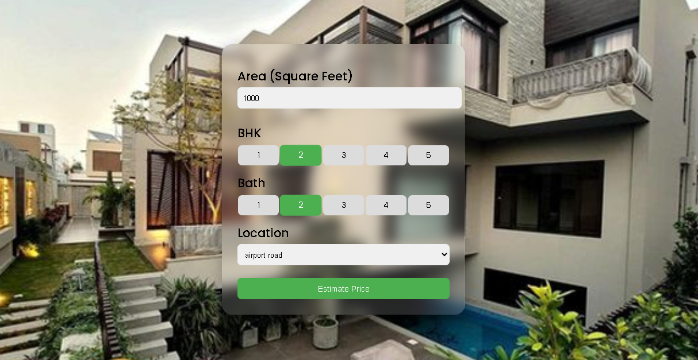

# 🏠 Karachi House Price Prediction  
A complete Machine Learning + Flask + JavaScript project that predicts house prices in Karachi based on **location, square-feet, BHK, and bathrooms**.

It includes:
- 🧠 ML Model (Linear Regression)
- 🖥️ Flask Backend API
- 💠 Modern Card-Style Frontend (HTML + CSS + JS)
- 🎞️ Animations & Loading Spinner
- 🔄 Improved API Error Handling
- 🎨 Updated UI & Background

---

## 📁 Project Structure

Real_State_Price_Prediction/
│── client/
│ ├── app.html
│ ├── app.css
│ └── app.js
│
│── model/
│ ├── columns.json
│ └── karachi_home_prices_model.pickle
│
│── server/
│ ├── server.py
│ ├── util.py
│ └── artifacts/
│ ├── columns.json
│ └── karachi_home_prices_model.pickle
│
├── UI.png

---

## 🚀 Features

### 🔥 Machine Learning
- Cleans dataset  
- One-hot encodes Karachi locations  
- Trains Linear Regression model  
- Saves model + columns.json to **/model** and **/server/artifacts**

### 🖥️ Backend (Flask API)
Endpoints:

- GET /get_location_names
- POST /predict_home_price

### 💠 Frontend (HTML + CSS + JS)
- Modern card UI  
- Loading spinner  
- Animated result  
- API error handling  
- Live price prediction

---

## ▶️ How to Run

### 1️⃣ Install Requirements
 - pip install flask pandas numpy scikit-learn

 ### 2️⃣ Start Server
- Go to:
    - D:\Machine_Learning_Codebasics\GitHub\Real_State_Price_Prediction\server

    - makefile
    - Copy code

- Run:
    - python server.py

- yaml
    - Copy code

- Your backend starts at:
    - http://127.0.0.1:5000

- yaml
    - Copy code

---

### 3️⃣ Run Frontend
    - Just open this file in browser:

    - D:\Machine_Learning_Codebasics\GitHub\Real_State_Price_Prediction\client\app.html

    - yaml
    - Copy code

---

## 🧪 API Endpoints

### ✔ Get Karachi Locations
- http://127.0.0.1:5000/get_location_names

- makefile
- Copy code

### ✔ Predict Price
- POST:
- http://127.0.0.1:5000/predict_home_price

- css
- Copy code

- Form Data:
- total_sqft
- location
- bhk
- bath

- yaml
- Copy code

---

## 🖼 UI Preview
- 

---

## 💡 Future Improvements
- Add model retraining from UI  
- Add charts & statistics  
- Add authentication  
- Deploy to Render / Railway  

---

## 👤 Author
**Faiz Ur Rehman Ashrafi**  
- Machine Learning Engineer (in progress)  
Karachi, Pakistan  

---

## ⭐ If you like this project, give it a star!